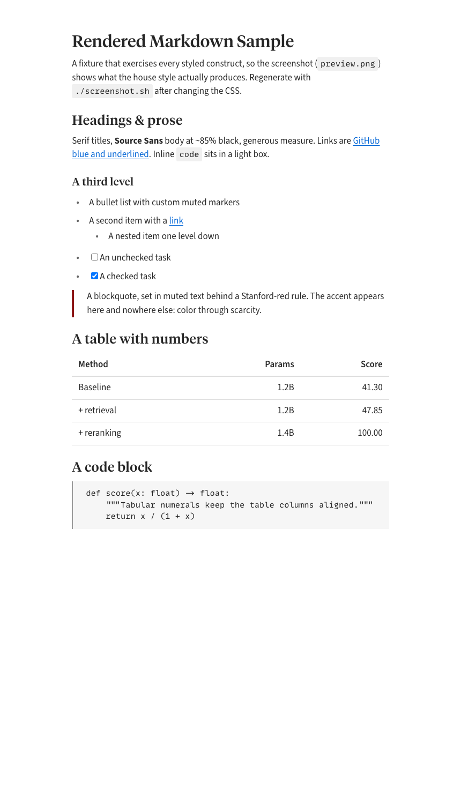

# Markdown CSS (single source of truth)

One place for how vault markdown looks, on screen and in print. Tracked in the (private) vault repo.

## Look

Rendered from `sample.md` through `tokens.css` + `preview.css`. **Regenerate after any CSS change** so this stays current: `./screenshot.sh` (needs pandoc + Chrome), then commit `preview.png`. The script renders the fixture the same way VS Code does, so it doubles as a quick visual check that a token change landed in both the look and the screenshot.

## Files

- `tokens.css` — shared house-style design tokens: palette (~85% black, grayscale, surgical Stanford red `#8c1515`) and font families (Source Serif/Tiempos titles, Source Sans body, Source Code mono). Source: `Personal/Personal Aesthetic.md`, `Concepts/Fonts.md`.
- `preview.css` — VS Code Markdown preview (screen): force light mode, rem sizes, vertical rhythm, hide the frontmatter table.
- `print.css` — `md-print` PDF (Chrome): `@page`, pt sizes, page-break control.
- `sample.md` + `screenshot.sh` — fixture and the script that renders `preview.png` (the image above).
- `agent_notes/` — `plan.md` (improvement backlog) and `lessons.md` (renderer gotchas).

`preview.css` and `print.css` both consume `tokens.css`'s `:root` variables. Change a color or font in `tokens.css` once and both media update. No `@import`: each consumer loads `tokens.css` as a separate stylesheet (CSS custom properties are global), which avoids webview/Chrome import-resolution issues.

## How each is wired

Standalone public repo, not tied to any vault.

- **Preview (global):** VS Code User-settings `markdown.styles` lists two jsdelivr URLs — `tokens.css` then `preview.css` — so the preview is styled in any folder. Edit here → push → purge jsdelivr (`curl https://purge.jsdelivr.net/gh/yoonholee/vscode-markdown-css@main/preview.css`) → bump the `?v=` in User settings so VS Code refetches → reopen preview.
- **Print (local):** `md-print.py` (`dotfiles/hosts/laptop/bin/`) passes `tokens.css` then `print.css` as two `--css` flags, read from a local clone at `~/repos/vscode-markdown-css` (override with `MD_CSS_DIR`). Edit → `md-print <file.md>` (offline; no CDN). Push to keep jsdelivr in sync for the preview.

After any change: run `./screenshot.sh` and commit `preview.png`.

## History

Briefly went private (then a vault submodule), because making it private broke jsdelivr delivery — a local `markdown.styles` file only loads inside a workspace folder, so the CSS had to live in the vault. But it's just CSS for VS Code, nothing secret, so it went back to public repo + jsdelivr (global, least machinery) and decoupled from the vault. Earlier still, `print.css` lived in dotfiles with hardcoded Helvetica — drift from the house style, now folded onto `tokens.css`.
